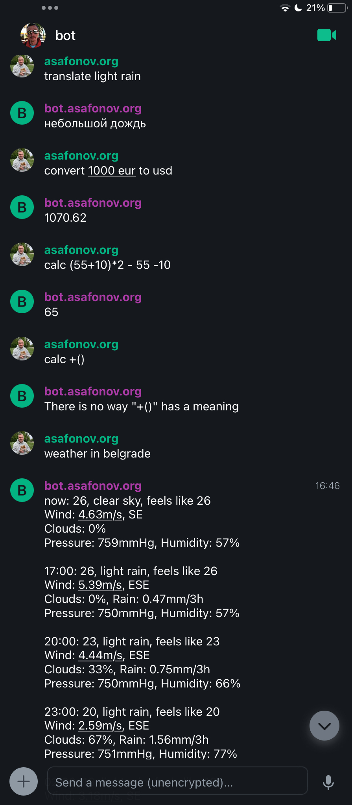

stille
=====

stille is a collection of plugin based bots for matrix.

Currently it contains the following plugins:

* weather/forecast -- prints current weather or forecast in the requested city. Keywords to activate the plugin are `weather in` or `forecast in`. For example `weather in Belgrade`. The plugin requires you to obtain an openweather api key.
* translate -- translates text into selected language. Keyword to activate the plugin is `translate`. The plugin requires you to obtain a translate.com api key
* convert -- convert currencies. Keyword to activate the plugin is `convert`. For example `convert 1000 usd to eur`
* calc -- simple calculator. Keyword to activate the plugin is `calc`. For example `calc (3+4)*2 - 5`

Installation
------------

Installation is pretty straightforward for a nodejs cli:

```bash
  npm install stille
```
or if you want to install it globally
```bash
  sudo npm install -g stille
```
That's it, now you can use it

Usage
-----

```bash
stille
```

Screnshot
-----



Have fun!
---------
